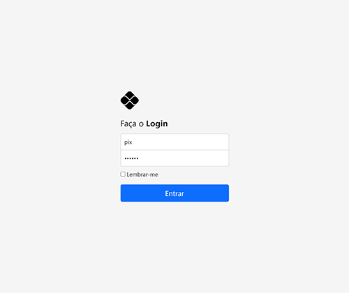
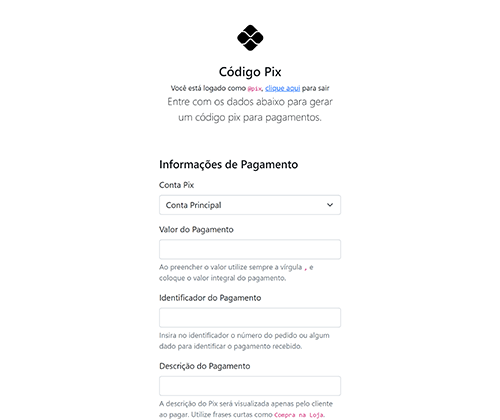

# Gere códigos Pix de um jeito fácil, rápido e prático

Com a chegada do Pix muitas lojas físicas começaram a se adaptar ao novo movimento. Mas, ainda tem um problema: *é complicado gerar um Pix*. Alguns de nossos clientes, por exemplo, precisam que vários colaboradores diferentes gerem um Pix. Mas, claro, nem todos eles podem acessar o app do banco para gerar um pix.

Se você apreciar a função desta aplicação e quiser apoiar este trabalho, sinta-se livre para fazer qualquer doação para a chave aleatória Pix `aae2196f-5f93-46e4-89e6-73bf4138427b` ❤.

Esse projeto surge para resolver esse problema. Ele é uma micro interface que gera códigos Pix em **QR Code** e no formato **Pix Copia & Cola**. Veja como ela funciona:

## Sobre a aplicação

1. O usuário abre a plataforma a partir de um domínio `https://pix.empresa.com.br` e insere seu usuário/ senha;
2. Ele é direcionado para uma interface para selecionar a Conta Pix e preencher os dados como: valor da compra, ID da transação e descrição;
3. Ao clicar no botão "Gerar Pix" uma nova interface exibe o **QR Code** que pode ser escaneado por outro aparelho ou um **Pix Copia & Cola** para compartilhar via internet.

Legal, não? O intuito aqui é ser simples. Por essa razão, não utilizamos frameworks disponíveis ou bancos de dados. Os usuários e as contas Pix são armazenados em `/app/config/users.php` e `/app/config/accounts.php` respectivamente.

### Quando devo utilizá-la?

* Se você quer gerar códigos Pix de uma maneira simples, fácil e rápido;
* Você quer que terceiros gerem um código Pix para você;
* Você não quer ficar entrando no app do Banco (e fazer um processo chato) o tempo todo para gerar novos Pix;
* Se você quer começar a vender com Pix de um jeito simples, fácil e rápido.

### Quais são os requisitos mínimos?

Você precisa ter um servidor Web como o **Apache** ou **Nginx**. Uma versão do **PHP 7.4** ou superior.

### Não sei como instalar/configurar, o que eu faço?

Entre em contato com a gente pelo e-mail [dev@piggly.com.br](mailto:dev@piggly.com.br) que iremos fazer o possível para ajudar você a implementar essa aplicação.

### Os usuários da aplicação

Só existe uma razão para nossa aplicação ter usuário: _previnir acesso deliberado_. As informações da aplicação não são sensíveis. São extremamente simples e utilizadas apenas para gerar os códigos Pix. Por essa razão o sistema de login e usuários é tão simples quanto. Apenas uma `array` com uma lista de usuários/senhas. 

### As contas Pix da aplicação

Também representam uma `array` com todas as contas cadastradas, que poderão ser selecionadas durante a geração dos códigos Pix. Nada demais e, novamente, não são informações sensíveis, logo não há com o que se preocupar.

### Mas... eu sou "desconfiado"

Neste caso, recomendando que crie as suas contas Pix na aplicação com as chaves aleatórias. Assim, você não expõe qualquer dado "sensível" como: e-mail, telefone, CPF ou CNPJ.

## Sobre o Pix

O **Pix** é o mais novo método de pagamento eletrônico criado pelo **Banco Central do Brasil**. Você encontra todos os detalhes na [página oficial](https://www.bcb.gov.br/estabilidadefinanceira/pix) do Pix.

Para implementá-lo nesta aplicação, utilizamos a nossa própria biblioteca [piggly-dev/php-pix](https://github.com/piggly-dev/php-pix). Caso você tenha problemas com a sua Chave Pix, como:

* **QR Code** inválido;
* **Pix Copia & Cola** inválido.

Sugerimos que você abra uma `issue` em nossa biblioteca pix, [clicando aqui](https://github.com/piggly-dev/php-pix/issues). Assim organizamos melhor a funcionalidade de cada uma das coisas.

## Instalação

Essa aplicação pode ser criada via **Composer** utilizando o seguinte comando `composer create-project piggly/php-pix-app pix`.

### Instalação guiada

Para facilitar a configuração do app. Habilitamos alguns comandos que ajudarão você a configurá-lo. Para isso, você precisa ter acesso ao `terminal` da sua máquina. Futuramente iremos implementar uma interface para essas configurações, mas por hora isso basta.

Vá para a pasta raiz da aplicação e execute o comando `php bin/console app:install`. Basta seguir todas as orientações na tela. Abaixo, a listagem de todos os comandos disponíveis:

* `php bin/console app:install` Realiza todas as configurações iniciais do app.
* `php bin/console user:change` Muda a senha do usuário.
* `php bin/console user:create` Cria um novo usuário.
* `php bin/console user:delete` Remove um usuário.
* `php bin/console user:list` Lista todos os usuários.
* `php bin/console account:create` Cria uma nova conta Pix.
* `php bin/console account:delete` Remove uma conta Pix.
* `php bin/console account:list` Lista todos as contas Pix.

### Instalação manual

Se você preferir ou não tiver acesso ao `terminal` da sua máquina, poderá fazer as configurações manualmente. Primeiro vá para `/app` e abra o arquivo `.env`. Nele, configure as seguintes variáveis:

* `DOMAIN` escreva o domínio incluindo http(s). Por exemplo: `https://pix.piggly.lab`;
* `HTTPS` escreva `true` se estiver usando https e `false` quando não;
* `SITE_NAME` escreva (entre aspas) o nome para a aplicação. Por exemplo: `"Pix por Piggly"`;
* `SESSION_NAME` escreva (sem espaços) o nome para a sessão da aplicação. Por exemplo: `pix_piggly_lab`;
* `SECRET_KEY` crie uma chave aleatória com 32 caracteres ou mais e coloque aqui. Por exemplo: `XnPvo6Wu3RAAP6i72poT0FH0pIXjWwCwOSA9Taenbs4="`;
* `BOOTSTRAP_CDN` escreva `true` se deseja utilizar o CDN do Bootstrap e `true` se não. Recomendamos `false` quando o acesso for interno (dentro de uma empresa), eles podem bloquear domínios desconhecidos e o `.css` externo não irá funcionar; Quando não for o caso, utilize `true` a política de cache será mais eficiente.

Depois, é a hora de configurar os usuário no arquivo `/app/config/users.php`, basta seguir o formato:

```[php]
<?php

return [ 
  [
    '_id' => '1',
    'username' => 'usuario01',
    'password' => 'senhaaleatoria',
  ],
];
```

E, por fim, configure as contas pix no arquivo `/app/config/accounts.php`, basta seguir o formato:

```[php]
<?php

return [
  'conta-01' => 
  [
    'label' => 'Conta 01',
    'merchantName' => 'Nome do Titular',
    'merchantCity' => 'Cidade do Titular',
    'keyType' => 'Tipo da Chave',
    'key' => 'Chave',
  ],
  'conta-02' => 
  [
    'label' => 'Conta 02',
    'merchantName' => 'Nome do Titular',
    'merchantCity' => 'Cidade do Titular',
    'keyType' => 'Tipo da Chave',
    'key' => 'Chave',
  ],
];
```

Em `keyType` é importante escrever os valores corretos, okay? Confira a tabela abaixo quais são os valores válidos:

| Tipo da Chave | $keyType
--- | ---
| CPF/CNPJ | `document`
| E-mail | `email`
| Telefone | `phone`
| Aleatória | `random`

## Telas

Veja abaixo as telas da aplicação, funcionando.






## Changelog

Veja o arquivo [CHANGELOG](CHANGELOG.md) para informações sobre todas as mudanças no código.

## Contribuições

Veja o arquivo [CONTRIBUTING](CONTRIBUTING.md) para informações antes de enviar sua contribuição.

## Segurança

Se você descobrir qualquer issue relacionada a segurança, por favor, envie um e-mail para [dev@piggly.com.br](mailto:dev@piggly.com.br) ao invés de utilizar o rastreador de issues do Github.

## Créditos

- [Caique Araujo](https://github.com/caiquearaujo)
- [All Contributors](../../contributors)

## Apoie o projeto

**Piggly Studio** é uma agência localizada no Rio de Janeiro, Brasil. Se você apreciar a função desta biblioteca e quiser apoiar este trabalho, sinta-se livre para fazer qualquer doação para a chave aleatória Pix `aae2196f-5f93-46e4-89e6-73bf4138427b` ❤.

## Licença

MIT License (MIT). Veja [LICENSE](LICENSE) para mais informações.